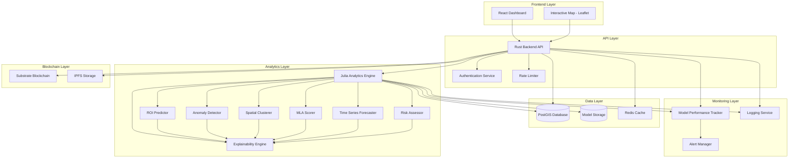

# Design Document: AI-Powered Blockchain GIS Platform for Rural India

## Overview

This design document specifies the architecture and implementation approach for an AI-powered blockchain GIS platform that combines spatial analytics, machine learning, blockchain verification, and interactive visualization to support economic development planning in rural India.

The platform integrates multiple technologies:
- **Rust** for high-performance backend APIs with memory safety
- **Julia** for AI/ML spatial analytics with numerical computing efficiency
- **PostGIS** for optimized geospatial data storage and queries
- **Substrate** blockchain for immutable audit trails
- **IPFS** for distributed evidence storage
- **React/TypeScript** for interactive dashboards and maps

The system provides five core AI capabilities:
1. Economic cluster detection using spatial clustering (DBSCAN, K-Means)
2. Investment ROI prediction using ensemble regression (Random Forest, XGBoost, Neural Networks)
3. MLA development impact scoring using weighted AI indices
4. Anomaly detection in spending using unsupervised learning (Isolation Forest, Autoencoders)
5. Explainable AI outputs using SHAP feature importance

All critical data and model outputs are cryptographically hashed and stored on a Substrate blockchain for verification and audit trails.

## Architecture

### High-Level Architecture




### System Architecture Principles

1. **Separation of Concerns**: Backend API (Rust) handles HTTP/REST, authentication, and orchestration; Analytics Engine (Julia) handles all AI/ML computations
2. **Polyglot Architecture**: Use the best language for each component (Rust for systems programming, Julia for numerical computing)
3. **Immutable Audit Trail**: All critical operations recorded on blockchain with cryptographic hashes
4. **Explainability First**: Every AI output accompanied by SHAP explanations
5. **Performance Optimization**: Caching, spatial indexing, and parallel computation for sub-5-second response times
6. **Scalability**: Stateless API design, horizontal scaling, connection pooling
7. **Security by Design**: TLS encryption, input validation, role-based access control, SQL injection prevention

### Communication Patterns

- **Frontend ↔ Backend**: REST API over HTTPS with JWT authentication
- **Backend ↔ Analytics Engine**: gRPC for efficient binary communication with Protocol Buffers
- **Backend ↔ PostGIS**: Connection pooling with prepared statements
- **Backend ↔ Blockchain**: Substrate RPC API for transaction submission and queries
- **Backend ↔ IPFS**: HTTP API for content storage and retrieval
- **Analytics Engine ↔ PostGIS**: Direct database connection for bulk data operations

## Components and Interfaces

### 1. Rust Backend API

**Responsibilities:**
- Handle HTTP requests and responses
- Authenticate and authorize users
- Validate and sanitize inputs
- Orchestrate calls to Analytics Engine
- Manage blockchain transactions
- Store and retrieve data from PostGIS
- Implement rate limiting and caching
- Generate audit logs

**Key Modules:**

```rust
// API Routes
mod routes {
    pub mod auth;           // Authentication endpoints
    pub mod gi_products;    // GI product CRUD operations
    pub mod predictions;    // ROI prediction endpoints
    pub mod clusters;       // Cluster detection endpoints
    pub mod mla_scores;     // MLA scoring endpoints
    pub mod anomalies;      // Anomaly detection endpoints
    pub mod forecasts;      // Time series forecasting
    pub mod risk;           // Risk assessment
    pub mod blockchain;     // Blockchain verification
    pub mod export;         // Data export endpoints
}

// Core Services
mod services {
    pub mod analytics_client;  // gRPC client for Julia engine
    pub mod blockchain_client; // Substrate blockchain client
    pub mod ipfs_client;       // IPFS storage client
    pub mod db;                // PostGIS database operations
    pub mod cache;             // Redis caching layer
    pub mod auth;              // JWT token management
}

// Data Models
mod models {
    pub struct GIProduct { /* ... */ }
    pub struct Prediction { /* ... */ }
    pub struct Cluster { /* ... */ }
    pub struct MLAScore { /* ... */ }
    pub struct Anomaly { /* ... */ }
    pub struct User { /* ... */ }
}
```

**API Endpoints:**

```
POST   /api/v1/auth/login
POST   /api/v1/auth/logout
GET    /api/v1/auth/verify

POST   /api/v1/gi-products
GET    /api/v1/gi-products
GET    /api/v1/gi-products/:id
PUT    /api/v1/gi-products/:id
DELETE /api/v1/gi-products/:id
GET    /api/v1/gi-products/region/:bounds

POST   /api/v1/predictions/roi
GET    /api/v1/predictions/:id
GET    /api/v1/predictions/:id/explanation

POST   /api/v1/clusters/detect
GET    /api/v1/clusters
GET    /api/v1/clusters/:id
GET    /api/v1/clusters/:id/explanation

POST   /api/v1/mla-scores/compute
GET    /api/v1/mla-scores
GET    /api/v1/mla-scores/:constituency_id
GET    /api/v1/mla-scores/:id/explanation

POST   /api/v1/anomalies/detect
GET    /api/v1/anomalies
GET    /api/v1/anomalies/:id
GET    /api/v1/anomalies/:id/explanation

POST   /api/v1/forecasts/generate
GET    /api/v1/forecasts/:id

POST   /api/v1/risk/assess
GET    /api/v1/risk/:id

GET    /api/v1/blockchain/verify/:hash
GET    /api/v1/blockchain/audit-trail/:entity_id

POST   /api/v1/export/csv
POST   /api/v1/export/geojson

GET    /api/v1/models/performance
GET    /api/v1/models/:model_id/metrics
```


### 2. Julia Analytics Engine

**Responsibilities:**
- Execute all AI/ML algorithms
- Train and update models
- Generate predictions and classifications
- Compute SHAP explanations
- Perform spatial clustering
- Detect anomalies
- Generate forecasts
- Assess risks
- Track model performance

**Key Modules:**

```julia
# Main service
module AnalyticsEngine
    using gRPC
    using DataFrames
    using LibPQ  # PostgreSQL/PostGIS client
    
    include("models/roi_predictor.jl")
    include("models/anomaly_detector.jl")
    include("models/spatial_clusterer.jl")
    include("models/mla_scorer.jl")
    include("models/forecaster.jl")
    include("models/risk_assessor.jl")
    include("explainability/shap_engine.jl")
    include("monitoring/performance_tracker.jl")
    include("utils/data_loader.jl")
    include("utils/feature_engineering.jl")
end

# ROI Prediction Module
module ROIPredictor
    using MLJ
    using XGBoost
    using Flux  # Neural networks
    
    struct EnsembleROIModel
        random_forest::RandomForestRegressor
        xgboost::XGBoostRegressor
        neural_net::Chain
        weights::Vector{Float64}
    end
    
    function predict_roi(model::EnsembleROIModel, features::DataFrame)::Prediction
        # Ensemble prediction with confidence intervals
    end
    
    function train_model(training_data::DataFrame)::EnsembleROIModel
        # Train ensemble with cross-validation
    end
end

# Anomaly Detection Module
module AnomalyDetector
    using OutlierDetection
    using Flux
    
    struct AnomalyModel
        isolation_forest::IsolationForest
        autoencoder::Chain
        threshold::Float64
    end
    
    function detect_anomalies(model::AnomalyModel, data::DataFrame)::Vector{Anomaly}
        # Detect anomalies using ensemble approach
    end
    
    function compute_anomaly_score(model::AnomalyModel, transaction::DataFrame)::Float64
        # Compute normalized anomaly score [0, 1]
    end
end

# Spatial Clustering Module
module SpatialClusterer
    using Clustering
    using Distances
    
    function detect_clusters(data::DataFrame, algorithm::Symbol)::ClusterResult
        # Apply DBSCAN or K-Means
    end
    
    function optimize_parameters(data::DataFrame)::Dict
        # Find optimal epsilon, min_points, or k
    end
    
    function compute_quality_metrics(clusters::ClusterResult)::Dict
        # Silhouette score, Davies-Bouldin index, etc.
    end
end

# MLA Scoring Module
module MLAScorer
    using MLJ
    
    struct MLAModel
        weight_model::GradientBoostingRegressor
        indicator_weights::Dict{String, Float64}
    end
    
    function compute_impact_score(model::MLAModel, indicators::DataFrame)::Float64
        # Compute weighted composite score
    end
    
    function learn_weights(historical_data::DataFrame)::Dict{String, Float64}
        # Learn optimal weights from outcomes
    end
end

# Explainability Module
module SHAPEngine
    using ShapML
    
    function compute_shap_values(model, data::DataFrame, prediction)::SHAPResult
        # Compute SHAP values for prediction
    end
    
    function generate_explanation(shap_result::SHAPResult)::Explanation
        # Create structured explanation with visualizations
    end
    
    function natural_language_summary(shap_result::SHAPResult)::String
        # Generate plain English explanation
    end
end
```

**gRPC Service Definition:**

```protobuf
syntax = "proto3";

package analytics;

service AnalyticsService {
    rpc PredictROI(ROIRequest) returns (ROIPrediction);
    rpc DetectAnomalies(AnomalyRequest) returns (AnomalyResponse);
    rpc DetectClusters(ClusterRequest) returns (ClusterResponse);
    rpc ComputeMLAScore(MLARequest) returns (MLAScore);
    rpc GenerateForecast(ForecastRequest) returns (ForecastResponse);
    rpc AssessRisk(RiskRequest) returns (RiskAssessment);
    rpc ExplainPrediction(ExplanationRequest) returns (SHAPExplanation);
    rpc GetModelMetrics(ModelMetricsRequest) returns (ModelMetrics);
    rpc TrainModel(TrainingRequest) returns (TrainingResponse);
}

message ROIRequest {
    double latitude = 1;
    double longitude = 2;
    string sector = 3;
    double investment_amount = 4;
    int32 timeframe_years = 5;
    map<string, double> additional_features = 6;
}

message ROIPrediction {
    double predicted_roi = 1;
    double confidence_lower = 2;
    double confidence_upper = 3;
    double variance = 4;
    string model_version = 5;
    repeated FeatureImportance feature_importance = 6;
}

message FeatureImportance {
    string feature_name = 1;
    double shap_value = 2;
}

// Additional message types...
```


### 3. PostGIS Geospatial Database

**Schema Design:**

```sql
-- GI Products Table
CREATE TABLE gi_products (
    id UUID PRIMARY KEY DEFAULT gen_random_uuid(),
    name VARCHAR(255) NOT NULL,
    description TEXT,
    category VARCHAR(100),
    location GEOMETRY(Point, 4326) NOT NULL,
    region VARCHAR(100),
    created_at TIMESTAMP DEFAULT NOW(),
    updated_at TIMESTAMP DEFAULT NOW(),
    metadata_hash VARCHAR(64),
    blockchain_tx_id VARCHAR(128)
);

CREATE INDEX idx_gi_products_location ON gi_products USING GIST(location);
CREATE INDEX idx_gi_products_region ON gi_products(region);

-- Economic Clusters Table
CREATE TABLE economic_clusters (
    id UUID PRIMARY KEY DEFAULT gen_random_uuid(),
    cluster_id INTEGER NOT NULL,
    boundary GEOMETRY(Polygon, 4326) NOT NULL,
    centroid GEOMETRY(Point, 4326) NOT NULL,
    algorithm VARCHAR(50),
    parameters JSONB,
    member_count INTEGER,
    density DOUBLE PRECISION,
    economic_value DOUBLE PRECISION,
    quality_metrics JSONB,
    detected_at TIMESTAMP DEFAULT NOW(),
    metadata_hash VARCHAR(64),
    blockchain_tx_id VARCHAR(128)
);

CREATE INDEX idx_clusters_boundary ON economic_clusters USING GIST(boundary);
CREATE INDEX idx_clusters_centroid ON economic_clusters USING GIST(centroid);

-- ROI Predictions Table
CREATE TABLE roi_predictions (
    id UUID PRIMARY KEY DEFAULT gen_random_uuid(),
    location GEOMETRY(Point, 4326) NOT NULL,
    sector VARCHAR(100),
    investment_amount DOUBLE PRECISION,
    timeframe_years INTEGER,
    predicted_roi DOUBLE PRECISION,
    confidence_lower DOUBLE PRECISION,
    confidence_upper DOUBLE PRECISION,
    variance DOUBLE PRECISION,
    model_version VARCHAR(50),
    features JSONB,
    shap_values JSONB,
    created_at TIMESTAMP DEFAULT NOW(),
    actual_roi DOUBLE PRECISION,  -- Filled in later for tracking
    metadata_hash VARCHAR(64),
    blockchain_tx_id VARCHAR(128)
);

CREATE INDEX idx_predictions_location ON roi_predictions USING GIST(location);
CREATE INDEX idx_predictions_sector ON roi_predictions(sector);

-- MLA Scores Table
CREATE TABLE mla_scores (
    id UUID PRIMARY KEY DEFAULT gen_random_uuid(),
    constituency_id VARCHAR(100) NOT NULL,
    constituency_boundary GEOMETRY(Polygon, 4326) NOT NULL,
    overall_score DOUBLE PRECISION,
    infrastructure_score DOUBLE PRECISION,
    education_score DOUBLE PRECISION,
    healthcare_score DOUBLE PRECISION,
    employment_score DOUBLE PRECISION,
    economic_growth_score DOUBLE PRECISION,
    weights JSONB,
    indicators JSONB,
    shap_values JSONB,
    confidence_interval JSONB,
    computed_at TIMESTAMP DEFAULT NOW(),
    metadata_hash VARCHAR(64),
    blockchain_tx_id VARCHAR(128)
);

CREATE INDEX idx_mla_scores_boundary ON mla_scores USING GIST(constituency_boundary);
CREATE INDEX idx_mla_scores_constituency ON mla_scores(constituency_id);

-- Anomalies Table
CREATE TABLE anomalies (
    id UUID PRIMARY KEY DEFAULT gen_random_uuid(),
    transaction_id VARCHAR(100),
    location GEOMETRY(Point, 4326),
    amount DOUBLE PRECISION,
    category VARCHAR(100),
    timestamp TIMESTAMP,
    anomaly_score DOUBLE PRECISION,
    severity VARCHAR(20),  -- 'low', 'medium', 'high', 'critical'
    isolation_forest_score DOUBLE PRECISION,
    autoencoder_score DOUBLE PRECISION,
    shap_values JSONB,
    expected_value DOUBLE PRECISION,
    deviation_metrics JSONB,
    detected_at TIMESTAMP DEFAULT NOW(),
    confirmed BOOLEAN,
    metadata_hash VARCHAR(64),
    blockchain_tx_id VARCHAR(128)
);

CREATE INDEX idx_anomalies_location ON anomalies USING GIST(location);
CREATE INDEX idx_anomalies_severity ON anomalies(severity);
CREATE INDEX idx_anomalies_score ON anomalies(anomaly_score DESC);

-- Forecasts Table
CREATE TABLE forecasts (
    id UUID PRIMARY KEY DEFAULT gen_random_uuid(),
    region VARCHAR(100),
    indicator VARCHAR(100),
    horizon_years INTEGER,
    forecast_values JSONB,  -- Array of {date, value, lower_bound, upper_bound}
    model_type VARCHAR(50),
    mape DOUBLE PRECISION,
    shap_values JSONB,
    generated_at TIMESTAMP DEFAULT NOW(),
    metadata_hash VARCHAR(64),
    blockchain_tx_id VARCHAR(128)
);

-- Risk Assessments Table
CREATE TABLE risk_assessments (
    id UUID PRIMARY KEY DEFAULT gen_random_uuid(),
    project_id VARCHAR(100),
    location GEOMETRY(Point, 4326),
    risk_level VARCHAR(20),  -- 'low', 'medium', 'high', 'critical'
    risk_probabilities JSONB,
    overall_score DOUBLE PRECISION,
    financial_risk DOUBLE PRECISION,
    operational_risk DOUBLE PRECISION,
    social_risk DOUBLE PRECISION,
    environmental_risk DOUBLE PRECISION,
    shap_values JSONB,
    mitigation_recommendations TEXT[],
    assessed_at TIMESTAMP DEFAULT NOW(),
    metadata_hash VARCHAR(64),
    blockchain_tx_id VARCHAR(128)
);

CREATE INDEX idx_risk_location ON risk_assessments USING GIST(location);

-- Model Performance Tracking Table
CREATE TABLE model_performance (
    id UUID PRIMARY KEY DEFAULT gen_random_uuid(),
    model_name VARCHAR(100),
    model_version VARCHAR(50),
    metric_name VARCHAR(50),
    metric_value DOUBLE PRECISION,
    window_days INTEGER,
    measured_at TIMESTAMP DEFAULT NOW(),
    metadata JSONB
);

CREATE INDEX idx_model_performance_name ON model_performance(model_name, measured_at DESC);

-- Users Table
CREATE TABLE users (
    id UUID PRIMARY KEY DEFAULT gen_random_uuid(),
    username VARCHAR(100) UNIQUE NOT NULL,
    password_hash VARCHAR(255) NOT NULL,
    email VARCHAR(255),
    role VARCHAR(50),  -- 'administrator', 'analyst', 'viewer'
    created_at TIMESTAMP DEFAULT NOW(),
    last_login TIMESTAMP
);

-- Audit Log Table
CREATE TABLE audit_log (
    id UUID PRIMARY KEY DEFAULT gen_random_uuid(),
    user_id UUID REFERENCES users(id),
    action VARCHAR(100),
    entity_type VARCHAR(50),
    entity_id UUID,
    ip_address INET,
    timestamp TIMESTAMP DEFAULT NOW(),
    details JSONB
);

CREATE INDEX idx_audit_log_user ON audit_log(user_id, timestamp DESC);
CREATE INDEX idx_audit_log_entity ON audit_log(entity_type, entity_id);
```


### 4. Substrate Blockchain Layer

**Purpose:** Provide immutable audit trail for critical data and model outputs.

**Pallet Design:**

```rust
// Custom Substrate Pallet for GIS Platform
#[frame_support::pallet]
pub mod pallet {
    use frame_support::pallet_prelude::*;
    use frame_system::pallet_prelude::*;
    
    #[pallet::config]
    pub trait Config: frame_system::Config {
        type RuntimeEvent: From<Event<Self>> + IsType<<Self as frame_system::Config>::RuntimeEvent>;
    }
    
    #[pallet::pallet]
    pub struct Pallet<T>(_);
    
    // Storage for data hashes
    #[pallet::storage]
    pub type DataHashes<T: Config> = StorageMap<
        _,
        Blake2_128Concat,
        Vec<u8>,  // Hash
        DataRecord,
        OptionQuery,
    >;
    
    #[derive(Clone, Encode, Decode, Eq, PartialEq, RuntimeDebug, TypeInfo)]
    pub struct DataRecord {
        pub entity_type: Vec<u8>,  // "prediction", "cluster", "anomaly", etc.
        pub entity_id: Vec<u8>,
        pub data_hash: Vec<u8>,
        pub timestamp: u64,
        pub submitter: Vec<u8>,
    }
    
    #[pallet::event]
    #[pallet::generate_deposit(pub(super) fn deposit_event)]
    pub enum Event<T: Config> {
        DataHashStored { hash: Vec<u8>, entity_type: Vec<u8> },
        DataVerified { hash: Vec<u8>, valid: bool },
    }
    
    #[pallet::call]
    impl<T: Config> Pallet<T> {
        #[pallet::weight(10_000)]
        pub fn store_hash(
            origin: OriginFor<T>,
            entity_type: Vec<u8>,
            entity_id: Vec<u8>,
            data_hash: Vec<u8>,
        ) -> DispatchResult {
            let who = ensure_signed(origin)?;
            
            let record = DataRecord {
                entity_type: entity_type.clone(),
                entity_id,
                data_hash: data_hash.clone(),
                timestamp: <frame_system::Pallet<T>>::block_number().into(),
                submitter: who.encode(),
            };
            
            DataHashes::<T>::insert(&data_hash, record);
            Self::deposit_event(Event::DataHashStored { hash: data_hash, entity_type });
            
            Ok(())
        }
        
        #[pallet::weight(5_000)]
        pub fn verify_hash(
            origin: OriginFor<T>,
            data_hash: Vec<u8>,
        ) -> DispatchResult {
            ensure_signed(origin)?;
            
            let valid = DataHashes::<T>::contains_key(&data_hash);
            Self::deposit_event(Event::DataVerified { hash: data_hash, valid });
            
            Ok(())
        }
    }
}
```

**Blockchain Operations:**

1. **Store Hash**: When critical data is created (prediction, cluster, anomaly, score), compute SHA-256 hash and submit to blockchain
2. **Verify Hash**: When data integrity needs verification, retrieve blockchain record and compare hashes
3. **Audit Trail**: Query blockchain for complete history of data modifications

### 5. IPFS Evidence Storage

**Purpose:** Store supporting documents, images, and reports in distributed, tamper-resistant storage.

**Operations:**

```rust
// IPFS Client Module
pub struct IPFSClient {
    api_url: String,
    client: reqwest::Client,
}

impl IPFSClient {
    pub async fn store_file(&self, content: Vec<u8>) -> Result<String, Error> {
        // Upload file to IPFS, return CID
        let response = self.client
            .post(&format!("{}/api/v0/add", self.api_url))
            .multipart(/* ... */)
            .send()
            .await?;
        
        let cid = response.json::<IPFSAddResponse>().await?.hash;
        Ok(cid)
    }
    
    pub async fn retrieve_file(&self, cid: &str) -> Result<Vec<u8>, Error> {
        // Retrieve file from IPFS by CID
        let response = self.client
            .post(&format!("{}/api/v0/cat?arg={}", self.api_url, cid))
            .send()
            .await?;
        
        let content = response.bytes().await?.to_vec();
        Ok(content)
    }
    
    pub async fn verify_content(&self, cid: &str, content: &[u8]) -> bool {
        // Verify content matches CID
        let computed_cid = self.compute_cid(content);
        computed_cid == cid
    }
}
```

### 6. React Dashboard

**Component Structure:**

```
src/
├── components/
│   ├── Map/
│   │   ├── InteractiveMap.tsx
│   │   ├── GIProductLayer.tsx
│   │   ├── ClusterLayer.tsx
│   │   ├── MLAScoreLayer.tsx
│   │   ├── AnomalyLayer.tsx
│   │   └── MapControls.tsx
│   ├── Visualizations/
│   │   ├── SHAPForceplot.tsx
│   │   ├── SHAPWaterfall.tsx
│   │   ├── SHAPSummary.tsx
│   │   ├── TimeSeriesChart.tsx
│   │   ├── BarChart.tsx
│   │   └── ScatterPlot.tsx
│   ├── Forms/
│   │   ├── ROIPredictionForm.tsx
│   │   ├── ClusterDetectionForm.tsx
│   │   ├── AnomalyDetectionForm.tsx
│   │   └── ForecastForm.tsx
│   ├── Panels/
│   │   ├── DetailPanel.tsx
│   │   ├── ExplanationPanel.tsx
│   │   ├── ModelMetricsPanel.tsx
│   │   └── BlockchainVerificationPanel.tsx
│   └── Auth/
│       ├── LoginForm.tsx
│       └── ProtectedRoute.tsx
├── services/
│   ├── api.ts
│   ├── mapService.ts
│   └── authService.ts
├── store/
│   ├── slices/
│   │   ├── authSlice.ts
│   │   ├── mapSlice.ts
│   │   ├── predictionsSlice.ts
│   │   └── clustersSlice.ts
│   └── store.ts
└── App.tsx
```

**Key Features:**

- Interactive Leaflet map with multiple data layers
- Real-time SHAP visualizations using D3.js
- Form-based prediction and analysis requests
- Blockchain verification indicators
- Model performance dashboards
- Responsive design for desktop and tablet


## Data Models

### Core Data Structures

```rust
// Rust Backend Models

#[derive(Debug, Serialize, Deserialize)]
pub struct GIProduct {
    pub id: Uuid,
    pub name: String,
    pub description: Option<String>,
    pub category: String,
    pub latitude: f64,
    pub longitude: f64,
    pub region: String,
    pub created_at: DateTime<Utc>,
    pub metadata_hash: Option<String>,
    pub blockchain_tx_id: Option<String>,
}

#[derive(Debug, Serialize, Deserialize)]
pub struct ROIPrediction {
    pub id: Uuid,
    pub location: Point,
    pub sector: String,
    pub investment_amount: f64,
    pub timeframe_years: i32,
    pub predicted_roi: f64,
    pub confidence_lower: f64,
    pub confidence_upper: f64,
    pub variance: f64,
    pub model_version: String,
    pub features: HashMap<String, f64>,
    pub shap_values: Vec<FeatureImportance>,
    pub created_at: DateTime<Utc>,
    pub metadata_hash: String,
    pub blockchain_tx_id: Option<String>,
}

#[derive(Debug, Serialize, Deserialize)]
pub struct FeatureImportance {
    pub feature_name: String,
    pub shap_value: f64,
}

#[derive(Debug, Serialize, Deserialize)]
pub struct EconomicCluster {
    pub id: Uuid,
    pub cluster_id: i32,
    pub boundary: Polygon,
    pub centroid: Point,
    pub algorithm: String,
    pub parameters: serde_json::Value,
    pub member_count: i32,
    pub density: f64,
    pub economic_value: f64,
    pub quality_metrics: QualityMetrics,
    pub shap_values: Vec<FeatureImportance>,
    pub detected_at: DateTime<Utc>,
    pub metadata_hash: String,
    pub blockchain_tx_id: Option<String>,
}

#[derive(Debug, Serialize, Deserialize)]
pub struct QualityMetrics {
    pub silhouette_score: f64,
    pub davies_bouldin_index: f64,
    pub calinski_harabasz_score: f64,
}

#[derive(Debug, Serialize, Deserialize)]
pub struct MLAScore {
    pub id: Uuid,
    pub constituency_id: String,
    pub constituency_boundary: Polygon,
    pub overall_score: f64,
    pub infrastructure_score: f64,
    pub education_score: f64,
    pub healthcare_score: f64,
    pub employment_score: f64,
    pub economic_growth_score: f64,
    pub weights: HashMap<String, f64>,
    pub indicators: HashMap<String, f64>,
    pub shap_values: Vec<FeatureImportance>,
    pub confidence_interval: (f64, f64),
    pub computed_at: DateTime<Utc>,
    pub metadata_hash: String,
    pub blockchain_tx_id: Option<String>,
}

#[derive(Debug, Serialize, Deserialize)]
pub struct Anomaly {
    pub id: Uuid,
    pub transaction_id: String,
    pub location: Option<Point>,
    pub amount: f64,
    pub category: String,
    pub timestamp: DateTime<Utc>,
    pub anomaly_score: f64,
    pub severity: AnomalySeverity,
    pub isolation_forest_score: f64,
    pub autoencoder_score: f64,
    pub shap_values: Vec<FeatureImportance>,
    pub expected_value: f64,
    pub deviation_metrics: DeviationMetrics,
    pub detected_at: DateTime<Utc>,
    pub confirmed: Option<bool>,
    pub metadata_hash: String,
    pub blockchain_tx_id: Option<String>,
}

#[derive(Debug, Serialize, Deserialize)]
pub enum AnomalySeverity {
    Low,
    Medium,
    High,
    Critical,
}

#[derive(Debug, Serialize, Deserialize)]
pub struct DeviationMetrics {
    pub z_score: f64,
    pub percentile_rank: f64,
}

#[derive(Debug, Serialize, Deserialize)]
pub struct Forecast {
    pub id: Uuid,
    pub region: String,
    pub indicator: String,
    pub horizon_years: i32,
    pub forecast_values: Vec<ForecastPoint>,
    pub model_type: String,
    pub mape: f64,
    pub shap_values: Vec<FeatureImportance>,
    pub generated_at: DateTime<Utc>,
    pub metadata_hash: String,
    pub blockchain_tx_id: Option<String>,
}

#[derive(Debug, Serialize, Deserialize)]
pub struct ForecastPoint {
    pub date: DateTime<Utc>,
    pub value: f64,
    pub lower_bound: f64,
    pub upper_bound: f64,
}

#[derive(Debug, Serialize, Deserialize)]
pub struct RiskAssessment {
    pub id: Uuid,
    pub project_id: String,
    pub location: Point,
    pub risk_level: RiskLevel,
    pub risk_probabilities: HashMap<String, f64>,
    pub overall_score: f64,
    pub financial_risk: f64,
    pub operational_risk: f64,
    pub social_risk: f64,
    pub environmental_risk: f64,
    pub shap_values: Vec<FeatureImportance>,
    pub mitigation_recommendations: Vec<String>,
    pub assessed_at: DateTime<Utc>,
    pub metadata_hash: String,
    pub blockchain_tx_id: Option<String>,
}

#[derive(Debug, Serialize, Deserialize)]
pub enum RiskLevel {
    Low,
    Medium,
    High,
    Critical,
}

#[derive(Debug, Serialize, Deserialize)]
pub struct ModelMetrics {
    pub model_name: String,
    pub model_version: String,
    pub metrics: HashMap<String, f64>,
    pub window_days: i32,
    pub measured_at: DateTime<Utc>,
}

#[derive(Debug, Serialize, Deserialize)]
pub struct SHAPExplanation {
    pub prediction_id: Uuid,
    pub shap_values: Vec<FeatureImportance>,
    pub base_value: f64,
    pub predicted_value: f64,
    pub natural_language_summary: String,
    pub visualization_data: VisualizationData,
}

#[derive(Debug, Serialize, Deserialize)]
pub struct VisualizationData {
    pub force_plot: serde_json::Value,
    pub waterfall_plot: serde_json::Value,
    pub summary_plot: serde_json::Value,
}
```


## Correctness Properties

A property is a characteristic or behavior that should hold true across all valid executions of a system—essentially, a formal statement about what the system should do. Properties serve as the bridge between human-readable specifications and machine-verifiable correctness guarantees.

### Data Storage and Retrieval Properties

Property 1: GI Product Storage Round Trip
*For any* valid GI product data with geographic coordinates, storing the product then querying by its ID should return an equivalent product with all fields preserved
**Validates: Requirements 1.1**

Property 2: Geographic Boundary Validation
*For any* coordinate pair, the platform should accept it for storage if and only if it falls within valid Indian geographic boundaries (latitude 8°N to 37°N, longitude 68°E to 97°E)
**Validates: Requirements 1.2**

Property 3: Spatial Query Correctness
*For any* geographic region bounds and set of GI products, querying products by region should return exactly those products whose coordinates fall within the specified bounds
**Validates: Requirements 1.3**

### Blockchain Verification Properties

Property 4: Blockchain Hash Storage Completeness
*For any* critical data operation (prediction, cluster detection, anomaly detection, MLA scoring, risk assessment), the platform should compute a SHA-256 hash of the metadata and successfully store it on the blockchain with a timestamp
**Validates: Requirements 1.4, 2.6, 3.6, 4.6, 5.5, 7.5, 8.2, 8.3, 20.12, 22.11**

Property 5: Data Integrity Verification
*For any* data record with a blockchain hash, verification should succeed if the current data hash matches the blockchain-stored hash, and fail if they differ
**Validates: Requirements 8.4**

Property 6: Blockchain Transaction Retry
*For any* blockchain transaction that fails, the platform should retry up to 3 times before logging a permanent failure
**Validates: Requirements 8.6**

### Clustering Properties

Property 7: Dual Algorithm Clustering
*For any* geographic business dataset, cluster detection should execute both DBSCAN and K-Means algorithms and select the result with the higher silhouette score
**Validates: Requirements 2.1**

Property 8: Cluster Output Completeness
*For any* detected cluster, the result should include a unique identifier, geographic boundary (convex hull), centroid, member count, density, economic value, and quality metrics (silhouette score, Davies-Bouldin index, Calinski-Harabasz score)
**Validates: Requirements 2.2**

Property 9: Cluster Quality Thresholds
*For any* clustering result selected as optimal, the silhouette score should be ≥ 0.60 and the Davies-Bouldin index should be ≤ 1.0
**Validates: Requirements 2.4**

Property 10: Parameter Optimization
*For any* clustering operation, algorithm parameters (epsilon, min_points for DBSCAN; k for K-Means) should be determined through optimization (elbow method, silhouette analysis) rather than hardcoded values
**Validates: Requirements 2.5**

Property 11: Hierarchical Cluster Relationships
*For any* hierarchical clustering result, sub-clusters should be properly nested within their parent clusters (sub-cluster boundaries contained within parent boundaries)
**Validates: Requirements 2.11**

### ROI Prediction Properties

Property 12: Ensemble Prediction Composition
*For any* ROI prediction request, the prediction should be generated using an ensemble of at least 3 different algorithms (Random Forest, XGBoost, Neural Network)
**Validates: Requirements 3.1**

Property 13: Prediction Confidence Intervals
*For any* ROI prediction, the result should include confidence intervals at 95% confidence level where confidence_lower < predicted_roi < confidence_upper
**Validates: Requirements 3.4**

Property 14: Ensemble Variance Computation
*For any* ensemble prediction, the variance across individual model predictions should be computed and reported as an uncertainty metric
**Validates: Requirements 3.5**

Property 15: Prediction Metadata Completeness
*For any* stored prediction, the record should include model version, input features, prediction value, confidence interval, timestamp, and blockchain hash
**Validates: Requirements 3.6**

### MLA Scoring Properties

Property 16: Score Range Validity
*For any* MLA impact score computation, the overall score should be in the range [0, 100] and all component scores (infrastructure, education, healthcare, employment, economic growth) should also be in [0, 100]
**Validates: Requirements 4.1**

Property 17: Weighted Score Composition
*For any* MLA impact score, the overall score should equal the weighted sum of component scores using learned weights, and weights should sum to 1.0
**Validates: Requirements 4.1, 4.2**

Property 18: Score Normalization Fairness
*For any* set of constituencies scored in the same batch, scores should be normalized to account for baseline conditions, ensuring fair comparison across different starting points
**Validates: Requirements 4.5**

Property 19: Score Confidence Intervals
*For any* MLA score, confidence intervals should be computed reflecting data quality and completeness, with wider intervals for incomplete data
**Validates: Requirements 4.7**

Property 20: Significant Change Detection
*For any* MLA score update where the score changes by more than 15 points, the platform should generate automated insights explaining the change drivers
**Validates: Requirements 4.11**

### Anomaly Detection Properties

Property 21: Ensemble Anomaly Detection
*For any* anomaly detection operation, at least 2 unsupervised algorithms (Isolation Forest and Autoencoder) should be applied to identify anomalies
**Validates: Requirements 5.1**

Property 22: Anomaly Score Normalization
*For any* detected anomaly, the anomaly score should be normalized to the range [0, 1], where 0 indicates normal and 1 indicates maximum anomaly
**Validates: Requirements 5.2**

Property 23: Anomaly Severity Classification
*For any* anomaly with score > 0.8, it should be classified as "Critical" severity; 0.6-0.8 as "High"; 0.4-0.6 as "Medium"; < 0.4 as "Low"
**Validates: Requirements 5.2**

Property 24: Deviation Metrics Computation
*For any* detected anomaly, statistical deviation metrics (z-score and percentile rank) should be computed comparing the anomalous transaction to normal patterns
**Validates: Requirements 5.4**

Property 25: Configurable Threshold Adjustment
*For any* anomaly detection operation, users should be able to configure the anomaly threshold, and the system should respect the configured threshold when classifying anomalies
**Validates: Requirements 5.7**

Property 26: High-Severity Anomaly Alerting
*For any* newly detected anomaly with score > 0.8, an automated alert should be generated within 5 minutes
**Validates: Requirements 5.10**

Property 27: Adaptive Threshold Learning
*For any* anomaly marked as false positive by user feedback, the platform should log the false positive and adjust detection thresholds to reduce similar false positives
**Validates: Requirements 5.11**

### Explainability Properties

Property 28: Universal SHAP Coverage
*For any* AI model output (prediction, classification, score, forecast, risk assessment), SHAP feature importance values should be generated
**Validates: Requirements 2.3, 3.3, 4.4, 5.3, 7.1, 21.4, 22.4**

Property 29: Feature Importance Ranking
*For any* SHAP explanation, features should be ranked by absolute SHAP value contribution in descending order
**Validates: Requirements 7.2**

Property 30: Local and Global Explanations
*For any* model, the platform should support both local explanations (individual predictions) and global explanations (overall model behavior)
**Validates: Requirements 7.4**

Property 31: Natural Language Summaries
*For any* SHAP explanation, a natural language summary should be generated describing the top 3 contributing factors in plain English
**Validates: Requirements 7.8**

Property 32: Counterfactual Validity
*For any* counterfactual explanation showing how changing input features would alter predictions, applying the suggested changes should produce a prediction that moves in the indicated direction
**Validates: Requirements 7.9**

Property 33: SHAP Additivity Property
*For any* SHAP explanation, the sum of all SHAP values plus the base value should equal the predicted value (SHAP additivity property)
**Validates: Requirements 7.10**

Property 34: Explanation Quality Metrics
*For any* model, explanation quality metrics (fidelity score, consistency score) should be computed and reported
**Validates: Requirements 7.11**

### Model Performance Monitoring Properties

Property 35: Comprehensive KPI Logging
*For any* predictive model, the platform should monitor and log all relevant KPIs (accuracy, precision, recall, F1-score, AUC-ROC, R-squared, RMSE, MAE) depending on model type
**Validates: Requirements 20.1**

Property 36: Ground Truth Outcome Tracking
*For any* prediction where ground truth outcomes become available, the platform should log the actual outcome and compute prediction error
**Validates: Requirements 20.2, 3.9, 22.9**

Property 37: Rolling Window Performance Metrics
*For any* model performance evaluation, metrics should be computed on rolling windows (7 days, 30 days, 90 days) to track trends
**Validates: Requirements 20.3**

Property 38: Performance Degradation Alerting
*For any* model where performance drops below defined thresholds (R-squared < 0.70 for regression, accuracy < 0.80 for classification), automated alerts should be triggered
**Validates: Requirements 20.4, 5.10, 20.6, 20.11, 22.10**

Property 39: Latency and Throughput Tracking
*For any* prediction request, the platform should measure and log prediction latency and update throughput metrics
**Validates: Requirements 20.5**

Property 40: Automated Retraining on Drift
*For any* model where performance degradation exceeds 10% over 30 days, automated model retraining should be initiated
**Validates: Requirements 20.6**

Property 41: Confusion Matrix Generation
*For any* classification model, confusion matrices should be computed and displayed showing per-class performance
**Validates: Requirements 20.8**

Property 42: Feature Drift Detection
*For any* input feature, the platform should monitor statistical properties (mean, variance, distribution) over time and detect drift when KL divergence exceeds 0.1
**Validates: Requirements 20.10, 20.11**

Property 43: Fairness Metrics Computation
*For any* model affecting resource allocation, fairness metrics (demographic parity, equal opportunity) should be computed and demographic parity ratio should be between 0.8 and 1.2
**Validates: Requirements 20.13**

### Forecasting Properties

Property 44: Multi-Horizon Forecasting
*For any* forecasting request, predictions should be generated for 1-year, 3-year, and 5-year horizons
**Validates: Requirements 21.1**

Property 45: Ensemble Forecasting
*For any* forecast generation, an ensemble of at least 3 algorithms (ARIMA, Prophet, LSTM) should be used
**Validates: Requirements 21.2**

Property 46: Forecast Confidence Intervals
*For any* forecast, prediction intervals should be provided at both 80% and 95% confidence levels
**Validates: Requirements 21.3**

Property 47: Baseline Comparison
*For any* forecast, predictions should be compared against baseline models (naive forecast, moving average) and improvement should be demonstrated
**Validates: Requirements 21.6**

Property 48: Seasonal Pattern Detection
*For any* time series data, the platform should detect seasonal patterns and trend changes and incorporate them into forecasts
**Validates: Requirements 21.9**

### Risk Assessment Properties

Property 49: Multi-Dimensional Risk Scoring
*For any* risk assessment, the evaluation should cover multiple dimensions (financial, operational, social, environmental) and compute an overall risk score
**Validates: Requirements 22.1**

Property 50: Risk Level Classification
*For any* risk assessment, projects should be classified into risk levels (low, medium, high, critical) using classification models
**Validates: Requirements 22.2**

Property 51: Calibrated Risk Probabilities
*For any* risk assessment, probability estimates for each risk category should be provided with calibrated confidence scores
**Validates: Requirements 22.3**

Property 52: Spatial Risk Factor Integration
*For any* risk assessment, spatial risk factors (proximity to infrastructure, climate vulnerability, economic indicators) should be incorporated into the risk model
**Validates: Requirements 22.6**

Property 53: Risk Mitigation Recommendations
*For any* risk assessment, the platform should provide risk mitigation recommendations based on similar historical projects
**Validates: Requirements 22.8**

Property 54: Risk Change Alerting
*For any* project where risk level probability shifts by more than 20%, automated alerts should be generated for stakeholders
**Validates: Requirements 22.10**

### Data Import/Export Properties

Property 55: Import Format Support
*For any* data import operation, the platform should accept CSV, GeoJSON, and Shapefile formats
**Validates: Requirements 15.1**

Property 56: Import Validation
*For any* data import, the platform should validate data schema and geographic coordinates before storage, rejecting invalid records with detailed error messages
**Validates: Requirements 15.2, 15.3**

Property 57: Export Format Support
*For any* data export operation, the platform should generate files in CSV and GeoJSON formats with complete metadata
**Validates: Requirements 15.5, 15.6, 15.7**

### Authentication and Authorization Properties

Property 58: Authentication Token Issuance
*For any* successful authentication, the platform should issue a JWT token with expiration time
**Validates: Requirements 14.2**

Property 59: Role-Based Access Control
*For any* operation requiring specific permissions, the platform should verify the user has the appropriate role (Administrator, Analyst, Viewer) before allowing the operation
**Validates: Requirements 14.3, 14.4**

Property 60: Account Lockout on Failed Attempts
*For any* user account with 5 consecutive failed authentication attempts, the account should be temporarily locked for 15 minutes
**Validates: Requirements 14.5**


## Error Handling

### Error Categories

1. **Input Validation Errors**
   - Invalid geographic coordinates
   - Missing required fields
   - Invalid data formats
   - Out-of-range values

2. **Authentication/Authorization Errors**
   - Invalid credentials
   - Expired tokens
   - Insufficient permissions
   - Account locked

3. **Data Processing Errors**
   - Database connection failures
   - Query timeouts
   - Data corruption
   - Constraint violations

4. **AI/ML Errors**
   - Model not found
   - Insufficient training data
   - Prediction failures
   - SHAP computation errors

5. **Blockchain Errors**
   - Transaction submission failures
   - Network connectivity issues
   - Verification failures
   - Insufficient gas/fees

6. **External Service Errors**
   - IPFS unavailable
   - gRPC communication failures
   - Third-party API errors

### Error Handling Strategy

**Rust Backend API:**

```rust
// Centralized error type
#[derive(Debug, thiserror::Error)]
pub enum PlatformError {
    #[error("Invalid input: {0}")]
    ValidationError(String),
    
    #[error("Authentication failed: {0}")]
    AuthError(String),
    
    #[error("Database error: {0}")]
    DatabaseError(#[from] sqlx::Error),
    
    #[error("Analytics engine error: {0}")]
    AnalyticsError(String),
    
    #[error("Blockchain error: {0}")]
    BlockchainError(String),
    
    #[error("IPFS error: {0}")]
    IPFSError(String),
    
    #[error("Not found: {0}")]
    NotFound(String),
    
    #[error("Internal server error: {0}")]
    InternalError(String),
}

// Convert errors to HTTP responses
impl IntoResponse for PlatformError {
    fn into_response(self) -> Response {
        let (status, error_message) = match self {
            PlatformError::ValidationError(msg) => (StatusCode::BAD_REQUEST, msg),
            PlatformError::AuthError(msg) => (StatusCode::UNAUTHORIZED, msg),
            PlatformError::NotFound(msg) => (StatusCode::NOT_FOUND, msg),
            _ => (StatusCode::INTERNAL_SERVER_ERROR, self.to_string()),
        };
        
        let body = Json(json!({
            "error": error_message,
            "timestamp": Utc::now().to_rfc3339(),
        }));
        
        (status, body).into_response()
    }
}

// Retry logic for blockchain transactions
async fn submit_to_blockchain_with_retry(
    data: &DataRecord,
    max_retries: u32,
) -> Result<String, PlatformError> {
    let mut attempts = 0;
    
    loop {
        match blockchain_client.submit_transaction(data).await {
            Ok(tx_id) => return Ok(tx_id),
            Err(e) if attempts < max_retries => {
                attempts += 1;
                warn!("Blockchain transaction failed (attempt {}/{}): {}", attempts, max_retries, e);
                tokio::time::sleep(Duration::from_secs(2_u64.pow(attempts))).await; // Exponential backoff
            }
            Err(e) => {
                error!("Blockchain transaction failed after {} attempts: {}", max_retries, e);
                return Err(PlatformError::BlockchainError(e.to_string()));
            }
        }
    }
}
```

**Julia Analytics Engine:**

```julia
# Custom error types
struct InsufficientDataError <: Exception
    message::String
end

struct ModelNotFoundError <: Exception
    model_name::String
end

struct PredictionError <: Exception
    message::String
end

# Error handling in prediction
function predict_roi_safe(model::EnsembleROIModel, features::DataFrame)::Result{Prediction, PredictionError}
    try
        if nrow(features) == 0
            return Err(PredictionError("No features provided"))
        end
        
        prediction = predict_roi(model, features)
        return Ok(prediction)
    catch e
        @error "Prediction failed" exception=(e, catch_backtrace())
        return Err(PredictionError("Prediction computation failed: $(e)"))
    end
end

# Graceful degradation for SHAP computation
function compute_shap_with_fallback(model, data::DataFrame, prediction)::SHAPResult
    try
        return compute_shap_values(model, data, prediction)
    catch e
        @warn "SHAP computation failed, returning empty explanation" exception=e
        return SHAPResult(
            shap_values=[],
            base_value=0.0,
            explanation="SHAP computation unavailable"
        )
    end
end
```

### Logging Strategy

**Structured Logging:**

```rust
// Log levels and contexts
use tracing::{info, warn, error, debug};

// Request logging
#[tracing::instrument(skip(body))]
async fn handle_prediction_request(
    user_id: Uuid,
    body: PredictionRequest,
) -> Result<PredictionResponse, PlatformError> {
    info!("Processing ROI prediction request");
    
    // Log input validation
    debug!("Validating input parameters");
    validate_prediction_request(&body)?;
    
    // Log analytics call
    info!("Calling analytics engine");
    let prediction = analytics_client.predict_roi(body).await
        .map_err(|e| {
            error!("Analytics engine call failed: {}", e);
            PlatformError::AnalyticsError(e.to_string())
        })?;
    
    // Log blockchain submission
    info!("Submitting to blockchain");
    let tx_id = submit_to_blockchain_with_retry(&prediction, 3).await?;
    
    info!("Prediction completed successfully");
    Ok(prediction)
}
```

**Audit Logging:**

All sensitive operations logged to audit_log table:
- User authentication attempts
- Data modifications
- Model predictions
- Blockchain transactions
- Configuration changes
- Access to sensitive data

## Testing Strategy

### Dual Testing Approach

The platform requires both unit testing and property-based testing for comprehensive coverage:

- **Unit tests**: Verify specific examples, edge cases, and error conditions
- **Property tests**: Verify universal properties across all inputs
- Together they provide comprehensive coverage: unit tests catch concrete bugs, property tests verify general correctness

### Unit Testing

**Rust Backend (using `cargo test`):**

```rust
#[cfg(test)]
mod tests {
    use super::*;
    
    #[tokio::test]
    async fn test_gi_product_creation() {
        let product = GIProduct {
            name: "Darjeeling Tea".to_string(),
            latitude: 27.0360,
            longitude: 88.2627,
            // ...
        };
        
        let result = create_gi_product(&product).await;
        assert!(result.is_ok());
    }
    
    #[tokio::test]
    async fn test_invalid_coordinates_rejected() {
        let product = GIProduct {
            name: "Invalid Product".to_string(),
            latitude: 100.0,  // Invalid
            longitude: 200.0,  // Invalid
            // ...
        };
        
        let result = create_gi_product(&product).await;
        assert!(matches!(result, Err(PlatformError::ValidationError(_))));
    }
    
    #[tokio::test]
    async fn test_authentication_lockout() {
        let username = "test_user";
        
        // Attempt 5 failed logins
        for _ in 0..5 {
            let result = authenticate(username, "wrong_password").await;
            assert!(result.is_err());
        }
        
        // 6th attempt should be locked
        let result = authenticate(username, "correct_password").await;
        assert!(matches!(result, Err(PlatformError::AuthError(_))));
    }
}
```

**Julia Analytics Engine (using `Test` module):**

```julia
using Test

@testset "ROI Prediction Tests" begin
    @testset "Ensemble prediction uses all models" begin
        model = load_test_model()
        features = DataFrame(
            latitude = [28.6139],
            longitude = [77.2090],
            sector = ["agriculture"],
            investment_amount = [1000000.0]
        )
        
        prediction = predict_roi(model, features)
        
        @test prediction.predicted_roi > 0
        @test prediction.confidence_lower < prediction.predicted_roi
        @test prediction.predicted_roi < prediction.confidence_upper
    end
    
    @testset "Insufficient data error" begin
        model = load_test_model()
        empty_features = DataFrame()
        
        @test_throws InsufficientDataError predict_roi(model, empty_features)
    end
end

@testset "Anomaly Detection Tests" begin
    @testset "High anomaly score triggers alert" begin
        anomaly = Anomaly(
            anomaly_score = 0.85,
            severity = "Critical"
        )
        
        @test should_trigger_alert(anomaly) == true
    end
    
    @testset "Normal transactions not flagged" begin
        normal_transaction = DataFrame(
            amount = [50000.0],
            category = ["infrastructure"],
            timestamp = [now()]
        )
        
        model = load_anomaly_model()
        score = compute_anomaly_score(model, normal_transaction)
        
        @test score < 0.4
    end
end
```

### Property-Based Testing

**Configuration:**
- Minimum 100 iterations per property test
- Each test tagged with feature name and property number
- Use appropriate PBT libraries: `proptest` (Rust), `Hypothesis.jl` (Julia)

**Rust Property Tests (using `proptest`):**

```rust
use proptest::prelude::*;

proptest! {
    // Feature: ai-blockchain-gis-platform, Property 1: GI Product Storage Round Trip
    #[test]
    fn test_gi_product_round_trip(
        name in "[a-zA-Z ]{1,100}",
        lat in 8.0f64..37.0f64,
        lon in 68.0f64..97.0f64,
    ) {
        let runtime = tokio::runtime::Runtime::new().unwrap();
        runtime.block_on(async {
            let product = GIProduct {
                name,
                latitude: lat,
                longitude: lon,
                // ... other fields
            };
            
            let created = create_gi_product(&product).await.unwrap();
            let retrieved = get_gi_product(created.id).await.unwrap();
            
            prop_assert_eq!(created.name, retrieved.name);
            prop_assert!((created.latitude - retrieved.latitude).abs() < 0.0001);
            prop_assert!((created.longitude - retrieved.longitude).abs() < 0.0001);
        });
    }
    
    // Feature: ai-blockchain-gis-platform, Property 2: Geographic Boundary Validation
    #[test]
    fn test_coordinate_validation(
        lat in -90.0f64..90.0f64,
        lon in -180.0f64..180.0f64,
    ) {
        let is_valid_india = lat >= 8.0 && lat <= 37.0 && lon >= 68.0 && lon <= 97.0;
        let validation_result = validate_coordinates(lat, lon);
        
        prop_assert_eq!(validation_result.is_ok(), is_valid_india);
    }
    
    // Feature: ai-blockchain-gis-platform, Property 3: Spatial Query Correctness
    #[test]
    fn test_spatial_query_correctness(
        products in prop::collection::vec(
            (8.0f64..37.0f64, 68.0f64..97.0f64),
            0..100
        ),
        query_lat_min in 8.0f64..35.0f64,
        query_lat_max in 10.0f64..37.0f64,
        query_lon_min in 68.0f64..95.0f64,
        query_lon_max in 70.0f64..97.0f64,
    ) {
        prop_assume!(query_lat_min < query_lat_max);
        prop_assume!(query_lon_min < query_lon_max);
        
        let runtime = tokio::runtime::Runtime::new().unwrap();
        runtime.block_on(async {
            // Store all products
            for (lat, lon) in &products {
                create_gi_product(&GIProduct {
                    latitude: *lat,
                    longitude: *lon,
                    // ...
                }).await.unwrap();
            }
            
            // Query by region
            let results = query_products_by_region(
                query_lat_min, query_lat_max,
                query_lon_min, query_lon_max
            ).await.unwrap();
            
            // Verify all results are within bounds
            for product in &results {
                prop_assert!(product.latitude >= query_lat_min);
                prop_assert!(product.latitude <= query_lat_max);
                prop_assert!(product.longitude >= query_lon_min);
                prop_assert!(product.longitude <= query_lon_max);
            }
            
            // Verify no products within bounds are missing
            let expected_count = products.iter().filter(|(lat, lon)| {
                *lat >= query_lat_min && *lat <= query_lat_max &&
                *lon >= query_lon_min && *lon <= query_lon_max
            }).count();
            
            prop_assert_eq!(results.len(), expected_count);
        });
    }
    
    // Feature: ai-blockchain-gis-platform, Property 4: Blockchain Hash Storage Completeness
    #[test]
    fn test_blockchain_hash_storage(
        prediction_value in 0.0f64..100.0f64,
    ) {
        let runtime = tokio::runtime::Runtime::new().unwrap();
        runtime.block_on(async {
            let prediction = ROIPrediction {
                predicted_roi: prediction_value,
                // ... other fields
            };
            
            let stored = store_prediction(&prediction).await.unwrap();
            
            // Verify hash was computed
            prop_assert!(stored.metadata_hash.is_some());
            
            // Verify blockchain transaction ID exists
            prop_assert!(stored.blockchain_tx_id.is_some());
            
            // Verify hash can be verified
            let verification = verify_blockchain_hash(&stored.metadata_hash.unwrap()).await.unwrap();
            prop_assert!(verification.valid);
        });
    }
}
```

**Julia Property Tests (using `Hypothesis.jl`):**

```julia
using Hypothesis

# Feature: ai-blockchain-gis-platform, Property 12: Ensemble Prediction Composition
@given(
    latitude = floats(min_value=8.0, max_value=37.0),
    longitude = floats(min_value=68.0, max_value=97.0),
    investment = floats(min_value=10000.0, max_value=10000000.0)
)
function test_ensemble_prediction_composition(latitude, longitude, investment)
    model = load_roi_model()
    features = DataFrame(
        latitude = [latitude],
        longitude = [longitude],
        investment_amount = [investment]
    )
    
    prediction = predict_roi(model, features)
    
    # Verify ensemble used at least 3 models
    @test length(prediction.model_contributions) >= 3
    @test "random_forest" in keys(prediction.model_contributions)
    @test "xgboost" in keys(prediction.model_contributions)
    @test "neural_net" in keys(prediction.model_contributions)
end

# Feature: ai-blockchain-gis-platform, Property 28: Universal SHAP Coverage
@given(
    model_output = one_of(
        builds(ROIPrediction),
        builds(MLAScore),
        builds(Anomaly),
        builds(RiskAssessment)
    )
)
function test_universal_shap_coverage(model_output)
    # Verify SHAP values exist for any model output
    @test hasfield(typeof(model_output), :shap_values)
    @test !isempty(model_output.shap_values)
    
    # Verify SHAP values are properly structured
    for shap_val in model_output.shap_values
        @test hasfield(typeof(shap_val), :feature_name)
        @test hasfield(typeof(shap_val), :shap_value)
        @test isfinite(shap_val.shap_value)
    end
end

# Feature: ai-blockchain-gis-platform, Property 33: SHAP Additivity Property
@given(
    features = data_frames(
        columns=Dict(
            "feature1" => floats(),
            "feature2" => floats(),
            "feature3" => floats()
        ),
        rows=just(1)
    )
)
function test_shap_additivity(features)
    model = load_test_model()
    prediction = predict_with_shap(model, features)
    
    # Sum of SHAP values + base value should equal prediction
    shap_sum = sum(sv.shap_value for sv in prediction.shap_values)
    total = shap_sum + prediction.base_value
    
    @test isapprox(total, prediction.predicted_value, rtol=0.01)
end
```

### Integration Testing

Test end-to-end workflows:
- User authentication → prediction request → blockchain verification
- Data import → clustering → visualization
- Anomaly detection → alerting → user feedback → threshold adjustment

### Performance Testing

Verify performance requirements:
- Load testing with 100 concurrent users
- Query response time < 2 seconds for 95% of requests
- Prediction latency < 5 seconds for 95% of requests
- Clustering completion < 30 seconds for 50,000 points

### Security Testing

- Penetration testing for authentication bypass
- SQL injection testing on all inputs
- XSS testing on dashboard
- Rate limiting verification
- TLS configuration validation

